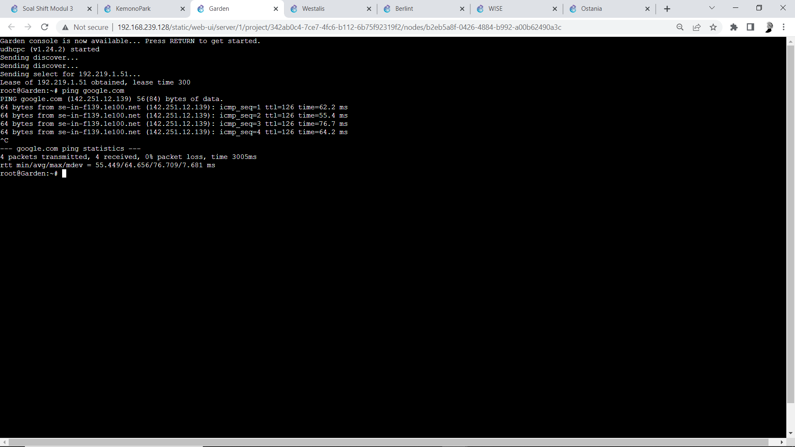

# Jarkom-Modul-3-ITB10-2022
| Nama | NRP |
| --- | --- |
| Jovan Surya Bako | 5027201013 |
| Gde Rio Aryaputra Rahadi | 5027201063 |

## Topologi GNS3


## Soal 1

Loid bersama Franky berencana membuat peta tersebut dengan kriteria WISE sebagai DNS Server, Westalis sebagai DHCP Server, Berlint sebagai Proxy Server (1)

Konfigurasi Ostania 
```
auto eth0
iface eth0 inet dhcp

auto eth1
iface eth1 inet static
	address 192.219.1.1
	netmask 255.255.255.0

auto eth2
iface eth2 inet static
	address 192.219.2.1
	netmask 255.255.255.0

auto eth3
iface eth3 inet static
	address 192.219.3.1
	netmask 255.255.255.0
```

Konfigurasi WISE
```
auto eth0
iface eth0 inet static
	address 192.219.2.2
	netmask 255.255.255.0
	gateway 192.219.2.1
```

Konfigurasi Berlint
```
auto eth0
iface eth0 inet static
	address 192.219.2.3
	netmask 255.255.255.0
	gateway 192.219.2.1
```

Konfigurasi Westalis
```
auto eth0
iface eth0 inet static
	address 192.219.2.4
	netmask 255.255.255.0
	gateway 192.219.2.1
```

Konfigurasi SSS, Garden, NewstonCastle, KemonoPark
```
auto eth0
iface eth0 inet dhcp
```

Konfigurasi Eden
```
auto eth0
iface eth0 inet dhcp
hwaddress ether 7a:ed:ff:1c:84:b0
```
Menjalankan command pada router Ostania
```
iptables -t nat -A POSTROUTING -j MASQUERADE -o eth0 -s 192.219.0.0/16
```

Menjalankan command pada pada WISE, Berlint, dan Westalis
```
echo "nameserver 192.168.122.1" > /etc/resolv.conf 
```

Mengupdate package list pada Ostania, WISE, Berlint, dan Westalis
```
apt-get update
```
Menginstall isc-dhcp-server pada Westalis
```
apt-get install isc-dhcp-server -y
```
Menginstall bind9 pada WISE
```
apt-get install bind9 -y
```
Menginstall squid3 pada Berlint
```   
apt-get install squid -y
```
Konfigurasi awal DHCP dengan membuka file /etc/default/isc-dhcp-server pada Westalis dan menambahkan eth0 pada section interface


Menambahkan line pada file /etc/dhcp/dhcpd.conf agar relay bisa berjalan melalui switch2 
```
subnet 192.219.2.0 netmask 255.255.255.0 {}
```

## Soal 2
dan Ostania sebagai DHCP Relay (2)

Menjalankan command pada Ostania 
```
apt-get update
apt-get install isc-dhcp-relay -y 
```
Saat menginstall isc-dhcp-relay akan muncul beberapa pertanyaan pop up, input IP Westalis (192.219.2.4) dan interfaces eth1 eth2 eth3


Kemudian restart service
```
service isc-dhcp-relay restart
```

## Soal 3
Semua client yang ada HARUS menggunakan konfigurasi IP dari DHCP Server.
Client yang melalui Switch1 mendapatkan range IP dari [prefix IP].1.50 - [prefix IP].1.88 dan [prefix IP].1.120 - [prefix IP].1.155 (3)

Agar node-node client mendapatkan IP dari DHCP server maka buat konfigurasi
```
auto eth0
iface eth0 inet dhcp
```
Pada Westalis edit file /etc/dhcp/dhcpd.conf menambahkan subnet .1.0 dengan konfigurasi:
```
subnet 192.219.1.0 netmask 255.255.255.0 {
        range 192.219.1.50 192.219.1.88;
        range 192.219.1.120 192.219.1.155;
        option routers 192.219.1.1;
        option broadcast-address 192.219.1.255;
        option domain-name-servers 192.219.2.2;
        default-lease-time 300;
        max-lease-time 6900;
    }
```

Lalu restart service
```
service isc-dhcp-server restart
```
Hasil pembagian IP otomatis pada node Garden (melalui switch1)


## Soal 4
Client yang melalui Switch3 mendapatkan range IP dari [prefix IP].3.10 - [prefix IP].3.30 dan [prefix IP].3.60 - [prefix IP].3.85 (4)

Pada Westalis edit file /etc/dhcp/dhcpd.conf menambahkan subnet .3.0 dengan konfigurasi:
```
    subnet 192.219.3.0 netmask 255.255.255.0 {
        range 192.219.3.10 192.219.3.30;
        range 192.219.3.60 192.219.3.85;
        option routers 192.219.3.1;
        option broadcast-address 192.219.3.255;
        option domain-name-servers 192.219.2.2;
        default-lease-time 600;
        max-lease-time 6900;
    }
```
Lalu restart service
```
service isc-dhcp-server restart 
```
Hasil pembagian IP otomatis pada node KemonoPark (melalui switch3)


## Soal 5
Client mendapatkan DNS dari WISE dan client dapat terhubung dengan internet melalui DNS tersebut. (5)
Sudah dikonfigurasi di nomor 3 dan 4 pada line
```
option domain-name-servers 192.219.2.2;
```

Pada WISE set DNS forwarders dan comment dnssec-validation auto; pada file /etc/bind/named.conf.options
```
options {
        directory "/var/cache/bind";
forwarders {
  192.168.122.1;
};

// dnssec-validation auto;
    allow-query { any; };
    auth-nxdomain no;    # conform to RFC1035
    listen-on-v6 { any; };
};

```
Lalu restart service 
```
service bind9 restart
```
Hasil ping google.com pada salah satu node client (Garden)


## Soal 6
Lama waktu DHCP server meminjamkan alamat IP kepada Client yang melalui Switch1 selama 5 menit sedangkan pada client yang melalui Switch3 selama 10 menit. Dengan waktu maksimal yang dialokasikan untuk peminjaman alamat IP selama 115 menit. (6)
Sudah dikonfigurasi di nomor 3 dan 4 pada line
```
subnet 192.219.1.0 …
default-lease-time 300;
max-lease-time 6900;
```
```
subnet 192.219.3.0 …
default-lease-time 600;
max-lease-time 6900;
```
Lease time pada Garden (melalui switch1)


Lease time pada KemonoPark (melalui switch3)


## Soal 7 
Loid dan Franky berencana menjadikan Eden sebagai server untuk pertukaran informasi dengan alamat IP yang tetap dengan IP [prefix IP].3.13 (7)
Mencari hwaddress_Eden dengan mengeksekusi command ip a di Eden, kemudian mengcopy address pada section link/ether di bagian eth0, yakni 7a:ed:ff:1c:84:b0, terlebih dahulu dimasukkan ke konfigurasi Eden agar tidak berubah saat restart
```
auto eth0
iface eth0 inet dhcp
hwaddress ether 7a:ed:ff:1c:84:b0
```
 
Kemudian dimasukkan pada konfigurasi isc-dhcp-server di Westalis.
```
host Eden {
        hardware ethernet 7a:ed:ff:1c:84:b0;
        fixed-address 192.219.3.13;
    }
```
Lalu restart dhcp service dan restart node Eden

Hasil IP Eden
    

